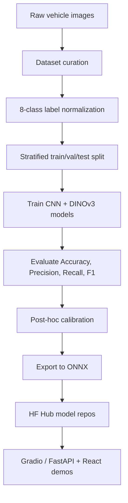

# AutoLens AI

**AutoLens AI** is an 8-class vehicle body type classifier built with PyTorch, ONNX Runtime, Gradio, FastAPI, and React. The project compares CNN and Vision Transformer models on a custom-curated vehicle dataset and deploys the selected model through HuggingFace-compatible inference.

[](https://www.python.org/)
[](https://github.com/astral-sh/uv)
[](https://onnxruntime.ai/)
[](https://huggingface.co/collections/morpeN1/autolens-vehicle-body-classification)

> Turkish README: [README.tr.md](README.tr.md)

---

## Live / Demo

- **HuggingFace model collection:** [AutoLens Vehicle Body Classification](https://huggingface.co/collections/morpeN1/autolens-vehicle-body-classification)
- **Selected model:** [morpeN1/autolens-dinov3-safe-weighted](https://huggingface.co/morpeN1/autolens-dinov3-safe-weighted)
- **HF Spaces demo:** [morpeN1/autolens-ai-demo](https://huggingface.co/spaces/morpeN1/autolens-ai-demo)

Screenshot from the demo: 

---

## What This Project Does

AutoLens AI predicts one of the following vehicle body types from a single image:

| Class | Class | Class | Class |
|---|---|---|---|
| SUV | VAN | STATION WAGON | MICRO |
| OPEN WHEEL / F1 | SEDAN | HATCHBACK | PICK UP |

The project includes:

- Custom dataset curation from multiple public sources
- Stratified train/validation/internal-test split
- CNN baselines: ResNet18, MobileNetV4, EfficientNet-B2
- Vision Transformer models: DINOv3 ViT-S/16 variants
- Post-hoc calibration: Temperature, Vector, Dirichlet
- ONNX export under the assignment's 95 MB limit
- Gradio demo for HuggingFace Spaces
- Optional full local web UI with FastAPI + React frontend
- IEEE-style final report

---

## Results Summary

Final model selection used the **internal_test** split (3170 images) and prioritized **macro F1-score**.

### Model Comparison (before calibration)

| Rank | Model | Accuracy | F1-macro | F1-weighted | ONNX Size |
|---:|---|---:|---:|---:|---:|
| 1 | **DINOv3 ViT-S/16 weighted** | **0.9438** | **0.9187** | **0.9442** | 82.6 MB |
| 2 | EfficientNet-B2 | 0.9202 | 0.8982 | 0.9201 | 29.4 MB |
| 3 | ResNet18 | 0.8968 | 0.8590 | 0.8963 | 42.6 MB |
| 4 | MobileNetV4 | 0.8905 | 0.8510 | 0.8912 | 32.1 MB |

### Final Model (after Dirichlet calibration)

| Metric | Value |
|---|---|
| Accuracy | **95.99%** |
| Macro F1 | **0.9537** |
| Weighted F1 | 0.9598 |
| ECE | **0.97%** |
| ONNX Size | 82.6 MB |

Read more:
- [Model comparison](docs/en/model-comparison.md)
- [Calibration results](docs/en/calibration.md)
- [Training notes](docs/en/training-notes.md)

---

## Pipeline



Full pipeline explanation: [docs/en/pipeline.md](docs/en/pipeline.md)

---

## Quick Start

### 1. Install dependencies

```bash
uv sync
```

### 2. Download the selected model from HuggingFace Hub

```bash
make download-hf-model
```

This downloads the selected DINOv3 weighted ONNX artifact and writes `artifacts/demo/active_model.json`.

Available models:

```bash
make download-hf-model MODEL=dinov3-weighted
make download-hf-model MODEL=dinov3-focal
make download-hf-model MODEL=dinov3-vits16
make download-hf-model MODEL=efficientnet-b2
make download-hf-model MODEL=resnet18
make download-hf-model MODEL=mobilenetv4
```

### 3A. Run the Gradio demo

```bash
make demo-gradio
```

Open: `http://localhost:7860`

### 3B. Run the full FastAPI + React web UI

```bash
make frontend-build
make demo-web
```

Open: `http://localhost:8080`

The React UI is optional but remains part of the repository. It uses the same `ONNXPredictor` backend through FastAPI.

---

## HuggingFace Models

| Model | HF Repo | Role |
|---|---|---|
| DINOv3 weighted | [autolens-dinov3-safe-weighted](https://huggingface.co/morpeN1/autolens-dinov3-safe-weighted) | Final selected model |
| DINOv3 focal | [autolens-dinov3-safe-focal](https://huggingface.co/morpeN1/autolens-dinov3-safe-focal) | Loss comparison |
| DINOv3 baseline | [autolens-dinov3-vits16](https://huggingface.co/morpeN1/autolens-dinov3-vits16) | ViT baseline |
| EfficientNet-B2 | [autolens-efficientnet-b2](https://huggingface.co/morpeN1/autolens-efficientnet-b2) | Strong CNN baseline |
| ResNet18 | [autolens-resnet18](https://huggingface.co/morpeN1/autolens-resnet18) | CNN baseline |
| MobileNetV4 | [autolens-mobilenetv4](https://huggingface.co/morpeN1/autolens-mobilenetv4) | Lightweight CNN baseline |

---

## Documentation

| Topic | English | Turkish |
|---|---|---|
| Pipeline | [docs/en/pipeline.md](docs/en/pipeline.md) | [docs/tr/pipeline.md](docs/tr/pipeline.md) |
| Dataset | [docs/en/dataset.md](docs/en/dataset.md) | [docs/tr/dataset.md](docs/tr/dataset.md) |
| Training | [docs/en/training-notes.md](docs/en/training-notes.md) | [docs/tr/training-notes.md](docs/tr/training-notes.md) |
| Model comparison | [docs/en/model-comparison.md](docs/en/model-comparison.md) | [docs/tr/model-comparison.md](docs/tr/model-comparison.md) |
| Calibration | [docs/en/calibration.md](docs/en/calibration.md) | [docs/tr/calibration.md](docs/tr/calibration.md) |
| UI / Demo | [docs/en/ui.md](docs/en/ui.md) | [docs/tr/ui.md](docs/tr/ui.md) |

Technical Report: [paper/autolens-ai-vehicle-body-type-classification-preprint.pdf](paper/autolens-ai-vehicle-body-type-classification-preprint.pdf)

---

## Paper / Technical Report

A technical report describing the AutoLens AI methodology, experiments, calibration results, and deployment pipeline is available here:

[AutoLens AI: Lightweight Vehicle Body Type Classification with Vision Transformers, Calibration, and ONNX Deployment](paper/autolens-ai-vehicle-body-type-classification-preprint.pdf)

---

## Repository Structure

```text
.
├── app.py                  # Gradio demo / HF Spaces entrypoint
├── api.py                  # FastAPI backend for React UI
├── frontend/               # Vite + React web UI
├── src/autolens_ai/        # Training, evaluation, inference package
├── scripts/                # Dataset, export, calibration, HF download scripts
├── configs/                # Hydra experiment configs
├── artifacts/              # Metadata, metrics, calibration, plots (no model binaries)
├── docs/                   # EN/TR documentation
├── report/                 # IEEE LaTeX report and final PDF
├── tests/                  # Unit tests
├── pyproject.toml
└── uv.lock
```

Large model binaries (`.onnx`, `.safetensors`) are intentionally excluded from GitHub and hosted on HuggingFace Hub.

---

## Quality Gates

```bash
make test
make lint
make typecheck
make check
```


