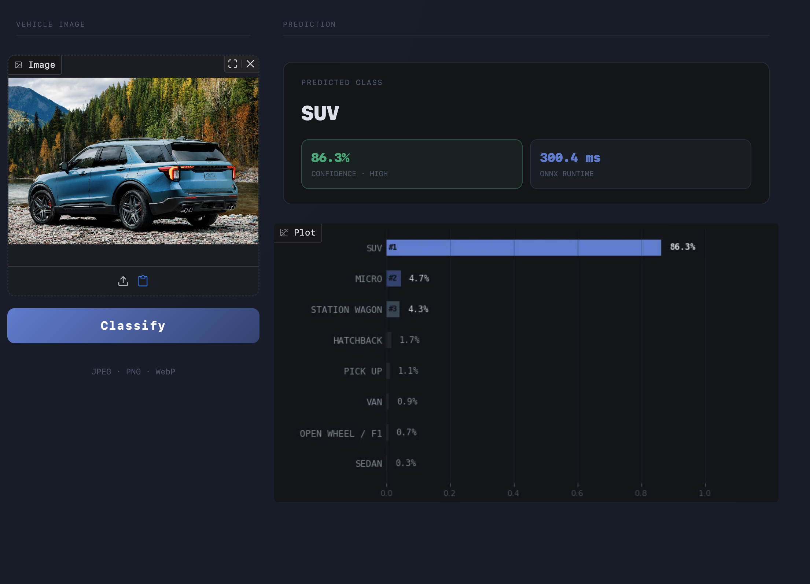
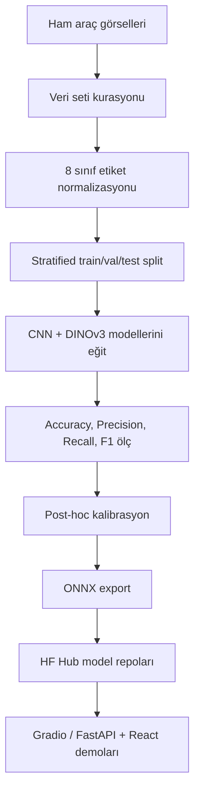

# AutoLens AI

**AutoLens AI**, araç görsellerini 8 farklı gövde tipine sınıflandıran bir bilgisayarlı görü projesidir. Projede özel olarak derlenmiş veri seti, CNN ve Vision Transformer modelleri, ONNX export, kalibrasyon ve web demo süreçleri birlikte ele alınmıştır.

[](https://www.python.org/)
[](https://github.com/astral-sh/uv)
[](https://onnxruntime.ai/)
[](https://huggingface.co/collections/morpeN1/autolens-vehicle-body-classification)

> English README: [README.md](README.md)

---

## Demo / Linkler

- **HuggingFace model collection:** [AutoLens Vehicle Body Classification](https://huggingface.co/collections/morpeN1/autolens-vehicle-body-classification)
- **Seçilen model:** [morpeN1/autolens-dinov3-safe-weighted](https://huggingface.co/morpeN1/autolens-dinov3-safe-weighted)
- **HF Spaces demo:** [morpeN1/autolens-ai-demo](https://huggingface.co/spaces/morpeN1/autolens-ai-demo)



---

## Proje Ne Yapıyor?

AutoLens AI tek bir araç görselinden şu 8 sınıftan birini tahmin eder:

| Sınıf | Sınıf | Sınıf | Sınıf |
|---|---|---|---|
| SUV | VAN | STATION WAGON | MICRO |
| OPEN WHEEL / F1 | SEDAN | HATCHBACK | PICK UP |

Proje kapsamında:

- Farklı açık kaynaklardan özel veri seti kurasyonu yapıldı.
- Stratified train/validation/internal-test split oluşturuldu.
- CNN baselinelar eğitildi: ResNet18, MobileNetV4, EfficientNet-B2.
- Vision Transformer modelleri eğitildi: DINOv3 ViT-S/16 varyantları.
- Temperature, Vector ve Dirichlet calibration denendi.
- Final model 95 MB sınırının altında ONNX olarak export edildi.
- HF Spaces için Gradio demo hazırlandı.
- Lokal kullanım için FastAPI + React web arayüzü korundu.
- IEEE formatında final rapor üretildi.

---

## Sonuç Özeti

Final seçim **internal_test** split (3170 görüntü) üzerinde **macro F1-score** öncelikli yapıldı.

### Model Karşılaştırması (kalibrasyon öncesi)

| Rank | Model | Accuracy | F1-macro | F1-weighted | ONNX Boyutu |
|---:|---|---:|---:|---:|---:|
| 1 | **DINOv3 ViT-S/16 weighted** | **0.9438** | **0.9187** | **0.9442** | 82.6 MB |
| 2 | EfficientNet-B2 | 0.9202 | 0.8982 | 0.9201 | 29.4 MB |
| 3 | ResNet18 | 0.8968 | 0.8590 | 0.8963 | 42.6 MB |
| 4 | MobileNetV4 | 0.8905 | 0.8510 | 0.8912 | 32.1 MB |

### Nihai Model (Dirichlet kalibrasyon sonrası)

| Metrik | Değer |
|---|---|
| Accuracy | **%95.99** |
| Macro F1 | **0.9537** |
| Weighted F1 | 0.9598 |
| ECE | **%0.97** |
| ONNX Boyutu | 82.6 MB |

Detaylar:
- [Model karşılaştırması](docs/tr/model-comparison.md)
- [Kalibrasyon sonuçları](docs/tr/calibration.md)
- [Eğitim notları](docs/tr/training-notes.md)

---

## Pipeline



Pipeline detayları: [docs/tr/pipeline.md](docs/tr/pipeline.md)

---

## Hızlı Başlangıç

### 1. Bağımlılıkları kur

```bash
uv sync
```

### 2. HF Hub'dan final modeli indir

```bash
make download-hf-model
```

Bu komut DINOv3 weighted ONNX modelini indirir ve `artifacts/demo/active_model.json` dosyasını oluşturur.

Farklı model indirmek için:

```bash
make download-hf-model MODEL=dinov3-weighted
make download-hf-model MODEL=dinov3-focal
make download-hf-model MODEL=dinov3-vits16
make download-hf-model MODEL=efficientnet-b2
make download-hf-model MODEL=resnet18
make download-hf-model MODEL=mobilenetv4
```

### 3A. Gradio demo çalıştır

```bash
make demo-gradio
```

Adres: `http://localhost:7860`

### 3B. React + FastAPI tam web arayüzünü çalıştır

```bash
make frontend-build
make demo-web
```

Adres: `http://localhost:8080`

React arayüzü opsiyoneldir ama repoda korunur. Aynı `ONNXPredictor` backend'ini FastAPI üzerinden kullanır.

---

## HuggingFace Modelleri

| Model | HF Repo | Rol |
|---|---|---|
| DINOv3 weighted | [autolens-dinov3-safe-weighted](https://huggingface.co/morpeN1/autolens-dinov3-safe-weighted) | Final seçilen model |
| DINOv3 focal | [autolens-dinov3-safe-focal](https://huggingface.co/morpeN1/autolens-dinov3-safe-focal) | Loss karşılaştırması |
| DINOv3 baseline | [autolens-dinov3-vits16](https://huggingface.co/morpeN1/autolens-dinov3-vits16) | ViT baseline |
| EfficientNet-B2 | [autolens-efficientnet-b2](https://huggingface.co/morpeN1/autolens-efficientnet-b2) | Güçlü CNN baseline |
| ResNet18 | [autolens-resnet18](https://huggingface.co/morpeN1/autolens-resnet18) | CNN baseline |
| MobileNetV4 | [autolens-mobilenetv4](https://huggingface.co/morpeN1/autolens-mobilenetv4) | Lightweight CNN baseline |

---

## Dokümantasyon

| Konu | Türkçe | English |
|---|---|---|
| Pipeline | [docs/tr/pipeline.md](docs/tr/pipeline.md) | [docs/en/pipeline.md](docs/en/pipeline.md) |
| Veri seti | [docs/tr/dataset.md](docs/tr/dataset.md) | [docs/en/dataset.md](docs/en/dataset.md) |
| Eğitim | [docs/tr/training-notes.md](docs/tr/training-notes.md) | [docs/en/training-notes.md](docs/en/training-notes.md) |
| Model karşılaştırması | [docs/tr/model-comparison.md](docs/tr/model-comparison.md) | [docs/en/model-comparison.md](docs/en/model-comparison.md) |
| Kalibrasyon | [docs/tr/calibration.md](docs/tr/calibration.md) | [docs/en/calibration.md](docs/en/calibration.md) |
| Arayüz | [docs/tr/ui.md](docs/tr/ui.md) | [docs/en/ui.md](docs/en/ui.md) |

Final IEEE rapor: [report/main.pdf](report/main.pdf)

---

## 📄 IEEE Rapor

Tam IEEE formatındaki akademik rapor derlenmiş PDF olarak sunulmuştur:

📎 **[AutoLens AI — IEEE Teknik Rapor (PDF)](report/main.pdf)**

Rapor; veri seti kurasyonu, model mimarisi karşılaştırması, ablasyon çalışmaları (Weighted CE vs Focal Loss, augmentation etkisi), post-hoc kalibrasyon analizi (Temperature, Vector, Dirichlet) ve deployment detaylarını kapsamaktadır — 9 sayfa, tam referanslarla.

---

## Repo Yapısı

```text
.
├── app.py                  # Gradio demo / HF Spaces entrypoint
├── api.py                  # React UI için FastAPI backend
├── frontend/               # Vite + React web arayüzü
├── src/autolens_ai/        # Training, evaluation, inference package
├── scripts/                # Dataset, export, calibration, HF download scriptleri
├── configs/                # Hydra experiment configleri
├── artifacts/              # Metadata, metrics, calibration, plots (model binary yok)
├── docs/                   # EN/TR dokümantasyon
├── report/                 # IEEE LaTeX rapor ve final PDF
├── tests/                  # Testler
├── pyproject.toml
└── uv.lock
```

Büyük model dosyaları (`.onnx`, `.safetensors`) GitHub'a eklenmez; HuggingFace Hub üzerinde tutulur.

