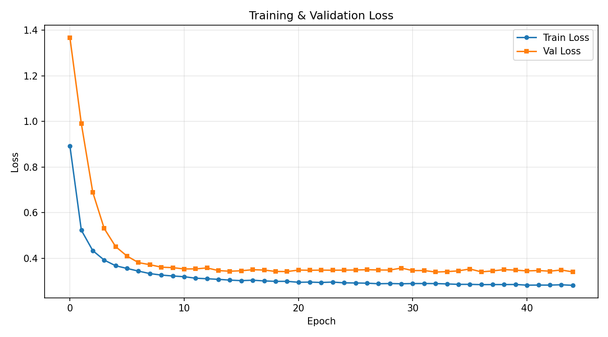
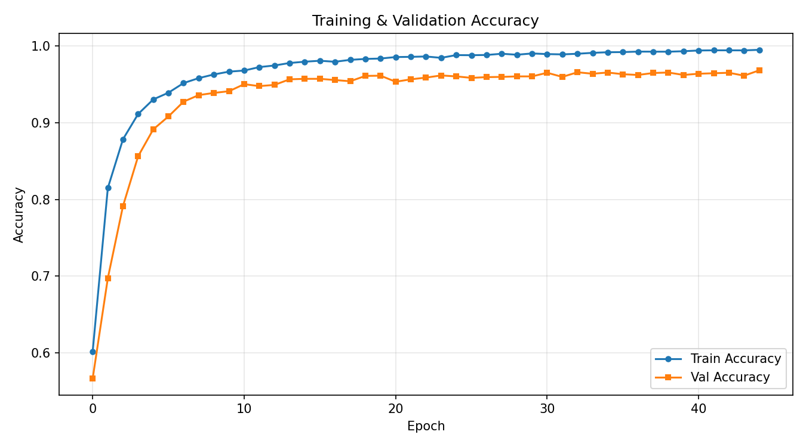
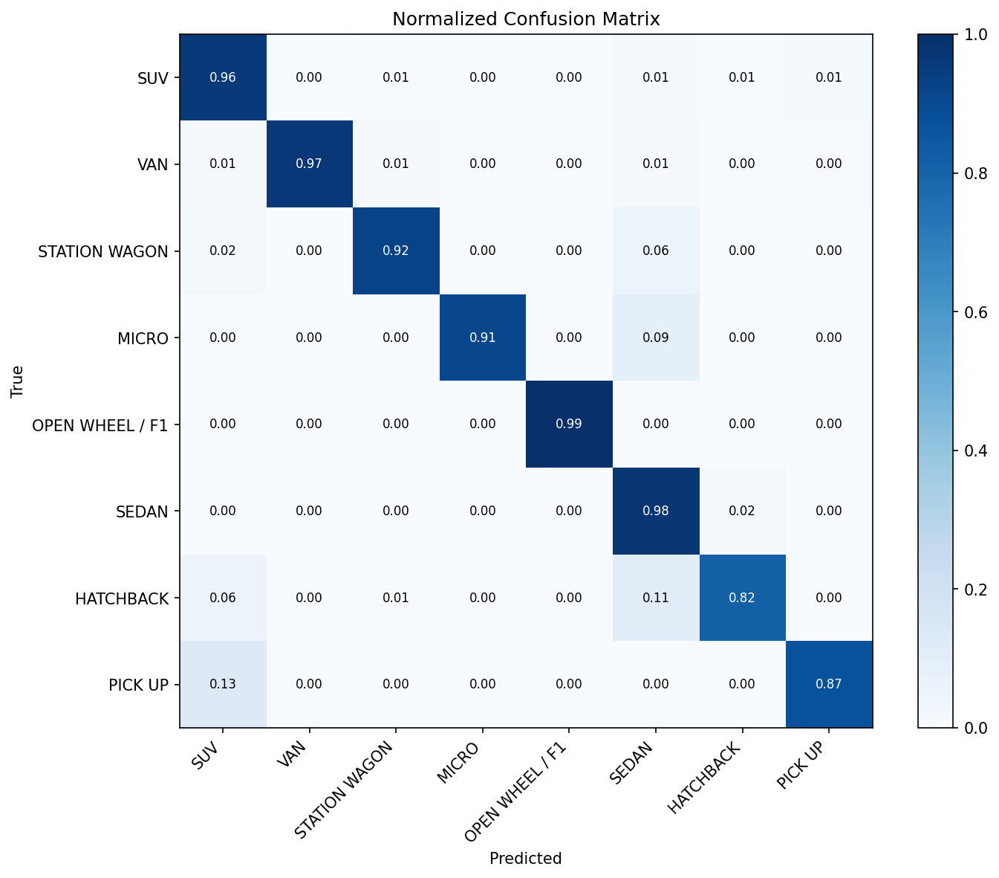

# AutoLens DINOv3 Safe Focal

Pre-calibration HF model card for the focal-loss DINOv3 candidate.

## Model

- Architecture: DINOv3 ViT-Small/16 (timm: `vit_small_patch16_dinov3`)
- Classes: 8 vehicle body types
- Source run: `dinov3_safe_focal_aug_20260510_111158`
- Source checkpoint: `checkpoints/dinov3_safe_focal_aug_20260510_111158/best-32-0.9537.ckpt`
- Export format: `model.safetensors` plus `metadata.json`, with ONNX for deployment
- Calibration status: **not applied yet**; this repo is the pre-calibration package and will be updated later with temperature scaling

## Classes

- SUV
- VAN
- STATION WAGON
- MICRO
- OPEN WHEEL / F1
- SEDAN
- HATCHBACK
- PICK UP

## Preprocessing

- RGB input
- Resize: 256
- Center crop / model input: 256 x 256
- Mean: `[0.4429, 0.4354, 0.437]`
- Std: `[0.2456, 0.2421, 0.2449]`

## Validation Results

Validation was used to select the checkpoint. The metrics below come from the best validation epoch in `metrics.csv`.

- Best epoch: **32**
- Accuracy: **0.9658**
- F1-macro: **0.9537**
- F1-weighted: **0.9659**
- Precision-macro: 0.9587
- Recall-macro: 0.9500
- Loss: 0.3394

## Internal Test Results

Evaluated on the held-out internal test set (3170 samples, no data leakage).

- Accuracy: **0.9505**
- F1-macro: **0.9302**
- F1-weighted: **0.9502**
- Precision-macro: 0.9358
- Recall-macro: 0.9269

### Per-class Performance

| Class | Precision | Recall | F1-score | Support |
|---|---|---|---|---|
| SUV | 0.9171 | 0.9582 | 0.9372 | 670 |
| VAN | 1.0000 | 0.9670 | 0.9832 | 455 |
| STATION WAGON | 0.8133 | 0.9242 | 0.8652 | 66 |
| MICRO | 0.9524 | 0.9091 | 0.9302 | 22 |
| OPEN WHEEL / F1 | 0.9983 | 0.9949 | 0.9966 | 586 |
| SEDAN | 0.9423 | 0.9761 | 0.9589 | 836 |
| HATCHBACK | 0.9156 | 0.8158 | 0.8628 | 266 |
| PICK UP | 0.9474 | 0.8699 | 0.9070 | 269 |

## Training Curves

## Internal Test Confusion Matrix

## Artifact Sizes

- `model.safetensors`: 82.373 MB
- `model.onnx`: 82.572 MB

## Files

- `model.safetensors` — weights-only model artifact
- `metadata.json` — architecture, classes, preprocessing, source run, and artifact metadata
- `model.onnx` — ONNX Runtime inference artifact
- `metrics.csv` — epoch-level training and validation history
- `per_class_metrics.txt` — internal-test classification report
- `training_loss.png` — training/validation loss curve
- `training_accuracy.png` — training/validation accuracy curve
- `confusion_matrix.png` — normalized internal-test confusion matrix
- `size_check.json` / `size_report.json` — artifact size and ONNX smoke evidence
- `internal_test_results.json` — structured internal-test summary

## Intended use

Educational demo and report evidence for classifying uploaded vehicle images into the 8 AutoLens body-type classes.

## Limitations

The dataset is assembled from public/open sources and may contain domain bias. Similar body styles such as hatchback, station wagon, and sedan can be ambiguous. This repo is intentionally **pre-calibration**; probability calibration will be added in the next upload after temperature scaling is fitted.
