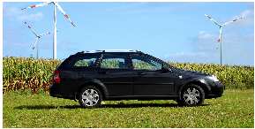
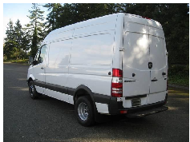
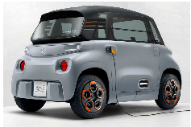
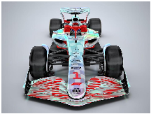
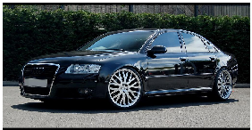
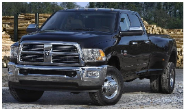

# KOCAELİ ÜNİVERSİTESİ BİLGİSAYAR MÜHENDİSLİĞİ BÖLÜMÜ YAZILIM LABORATUVARI-II

# PROJE III

## ARABA GÖVDE TİPİ SINIFLANDIRMA PROJESİ

Proje Teslim Tarihi: 30.05.2026

### 1. Proje Tanımı

Bu projede, farklı araba gövde tiplerine ait görüntülerden oluşan bir veri seti kullanılarak çoklu sınıflandırma problemi çözülecektir. Projede toplam 8 farklı araba gövde tipi sınıfı bulunmaktadır. Kendi oluşturacağınız veri setleri ile eğitilecek yapay zeka modelleri sonrasında daha önce hiç görülmemiş test verileriyle modelin performansı değerlendirilecektir.

##### Proje kapsamında aşağıdaki adımların tamamlanması beklenmektedir:

- ● Çeşitli kaynaklardan (Kaggle, Hugging Face vb.) ham görseller toplayarak 8 sınıfa uygun özelleştirilmiş (customize) bir veri seti oluşturmak
- ● Veri setine uygun ön işleme (preprocessing) adımlarını uygulamak
- ● Yapay zeka model mimarisi oluşturulması ve model eğitimi
- ● Modelin performansını Accuracy, Precision, Recall, F1-Score metrikleri ile ölçmek
- ● Sonuçları Training/Validation Loss grafiği, Accuracy grafiği ve Normalized Confusion Matrix ile görselleştirmek
- ● Eğitilmiş modeli kaydederek bir web arayüzüne entegre edip canlı tahmin yapabilir hale getirmek
- ● Tüm süreci IEEE formatında bir rapor ile belgelemek

ÖNEMLİ NOT: Sunum sırasında modeliniz, eğitim sürecinde hiç görmediği tamamen yeni test görüntüleri ile denenecektir. Bu nedenle modelinizin genelleme (generalization) yeteneği büyük önem taşımaktadır.

# 2. Proje Hedefleri

Değerlendirme Metrikleri: Modelin performansı aşağıdaki metriklerle ölçülmelidir:

Doğruluk (Accuracy)

Kesinlik (Precision)

Duyarlılık (Recall)

F1-Skoru (F1-Score)

Normalize Edilmiş Karışıklık Matrisi (Normalized Confusion Matrix)

Bu  metriklerin  hem  sınıf  bazlı  (per-class)  hem  de  ortalama  (macro  average  ve weighted average) değerleri hesaplanmalıdır.

NOT: F1 skoru 1. öncelikli performans metriği olarak değerlendirilecektir.

Görselleştirme: Eğitim sürecini ve model performansını gösteren grafikler hazırlanmalıdır:

Training & Validation Loss grafiği (epoch bazlı kayıp değişimi)

Training & Validation Accuracy grafiği (epoch bazlı doğruluk değişimi)

Normalized Confusion Matrix (8x8 heatmap)

Bu grafikler hem raporda hem de sunum sırasında sunulacaktır.

Arayüz: Eğitimini  tamamlayıp  kaydettiğiniz  modelinizi  canlı  test  edebileceğiniz, vereceğimiz test görüntülerini alıp tahmin döndürebilen bir web arayüzü geliştirilmelidir.  Arayüz  kullanıcı  dostu  olmalı,  görüntü yükleme, tahmin sonucu ve güven skoru gösterimi içermelidir.

# 3. Proje Adımları

# Kullanılacak Veri Seti:

Öğrenciler kendi veri setlerini oluşturacaklardır. Aşağıdaki Kaggle veri setleri yalnızca referans ve  ilham  kaynağı  olarak  verilmiştir.  Bu  veri  setlerini  doğrudan  kullanmak  zorunda  değilsiniz, ancak veri toplama sürecinde faydalanabilirsiniz.

# ÖNEMLİ:  Oluşturacak  olduğunuz  veri  seti  kaynağının  hem  sunum  sırasında  hem  de raporda belirtilmesi gerekmektedir.

Referans Veri Seti 1 - Cars Body Type Cropped:

https://www.kaggle.com/datasets/ademboukhris/cars-body-type-cropped

Referans Veri Seti 2 - Stanford Car Body Type Data:

https://www.kaggle.com/datasets/mayurmahurkar/stanford-car-body-type-data

Farklı açık kaynaklardan topladığınız görselleri aşağıdaki 8 sınıfa göre klasörlere ayırarak kendi özelleştirilmiş veri setinizi oluşturmanız gerekmektedir. Her sınıfta yeterli sayıda  görsel bulunmalıdır.

Projede tahmin edilecek 8 araba gövde tipi sınıfı şunlardır:

SUV

VAN

   STATION WAGON

   MİCRO

   AÇIK TEKERLEKLİ (F1 ARAÇLARI)

   SEDAN

   HATCHBACK

PICK UP

Her sınıfa ait örnek görseller aşağıda sunulmuştur:

SUV

STATION WAGON

VAN

MİCRO

AÇIK TEKERLEKLİ

SEDAN

HATCHBACK

PICK UP

NOT: Veri setinizi kendiniz oluşturacağınız için sınıflar arasındaki dengeye dikkat ediniz. Bir sınıfta çok fazla, diğerinde çok az görsel olması modelin performansını olumsuz etkileyecektir. Test Seti hakkında önemli bilgi:

- ○ Test verisi eğitim sürecinde hiçbir şekilde kullanılmayacaktır.
- ○ Test seti, sunum sırasında tarafımızdan sağlanacak olup modelinizin daha önce hiç görmediği tamamen yeni görüntülerden oluşacaktır.
- ○ Modelinizin nihai başarısı bu görülmemiş test görüntüleri üzerinden ölçülecektir.
- ○ Bu nedenle modelinizin genelleme (generalization) kapasitesi çok önemlidir. Eğitim setine aşırı uyum sağlamış bir model test setinde düşük performans gösterecektir.
- ○ Modelinizi geliştirirken farklı açılardan, farklı ışık koşullarında ve farklı arka planlardan çekilmiş araç görüntülerini veri setinize dahil etmeniz, genelleme kapasitesini artıracaktır.

#### Ön İşleme Adımları

Modelin başarısını artırmak için veri setine uygun ön işlemleri gerçekleştirebilirsiniz. Uygulanabilecek ön işlemler:

- ○ Boyutlandırma (224x224 veya modelin gerektirdiği giriş boyutu),
- ○ Normalizasyon
- ○ Histogram eşitleme, filtreleme, gürültü giderme gibi çeşitli görüntü işleme teknikleri,
- ○ Veri çoğaltma (Data Augmentation)

#### Model Eğitimi

Model mimarisi kısıtlaması yoktur. CNN tabanlı modeller (ResNet, EfficientNet, ConvNeXt, MobileNet vb.) veya transformer tabanlı modeller (Vision Transformer (ViT), Data-efficient Image Transformer (DeiT), Swin Transformer, BEiT vb.) kullanabilirsiniz.

ÖNEMLİ: Hangi model mimarisini seçerseniz seçin, yazdığınız kodun tamamından siz sorumlusunuz. Demo sırasında modelin mimarisi, katman yapısı, neden bu modeli tercih ettiğiniz, her bir kod bloğunun ne işe yaradığı gibi konularda detaylı sorular sorulacaktır. Kodunuzun her satırını açıklayabilmeniz beklenmektedir.

Batch size, epoch, dropout oranı, öğrenme oranı (learning rate) gibi hiperparametrelerin seçimini modelinize uygun olacak şekilde kendiniz belirlemelisiniz. Bu hiperparametrelerin kullanım amacını sunum sırasında açıklayabilmeniz beklenmektedir.

Overfitting'i önlemek için EarlyStopping gibi yöntemler kullanmanız önerilir. Test verisi eğitim sürecinde hiçbir şekilde kullanılmamalıdır. Test seti yalnızca modelin son performansını değerlendirmek için kullanılacaktır.

#### Modelin Değerlendirilmesi

Modelinizin başarısının değerlendirilmesinde öncelik sırasına göre F1-skoru (F1-score), doğruluk (Accuracy), kesinlik (Precision), duyarlılık (Recall) metriklerini kullanılacaktır.

Modelin test edilebilmesi ve performans sonuçları için tarafımızdan bir test scripti paylaşılacaktır. Modelinizin paylaşılacak bu script ile birlikte çalışabilir şekilde entegre edilmesi ve script tarafından istenen parametrelerin (örnek adı, tahmin kategori) doğru ve uyumlu biçimde verilmesi gerekmektedir.

Aşağıda beklenen grafik türleri verilmiştir:

● GRAFİK ALANI 1: Training & Validation Loss Grafiği X ekseni: Epoch sayısı Y ekseni: Loss değeri İki çizgi: Training Loss ve Validation Loss

Bu grafik, modelin öğrenme sürecini ve overfitting durumunu gösterir. Training loss ile validation loss arasındaki fark (gap) küçük olmalıdır.

● GRAFİK ALANI 2: Training & Validation Accuracy Grafiği X ekseni: Epoch sayısı Y ekseni: Accuracy (%) İki çizgi: Training Accuracy ve Validation Accuracy

Bu grafik, modelin doğruluk performansının epoch'lara göre değişimini gösterir.

● GRAFİK ALANI 3: Normalized Confusion Matrix (8x8) Satırlar: Gerçek sınıflar Sütunlar: Tahmin edilen sınıflar Her hücrede normalize edilmiş oran (0.00 - 1.00) gösterilmelidir. Diyagonal değerler yüksek olmalıdır (doğru tahminler). Renk haritası (heatmap) kullanılmalıdır.

#### Modelin Arayüzle Kullanılması

Eğitimini tamamlayıp kaydettiğiniz modeli geliştireceğiniz web arayüzünde kullanmalısınız. Arayüz web ortamında geliştirilmelidir (Flask, Django, Streamlit, Gradio vb. kullanılabilir). Arayüz için programlama dili kısıtı bulunmamaktadır.

Sunum esnasında, daha önce hiç görmediğiniz test görüntüleri tarafımızdan verilecek ve arayüz üzerinden canlı olarak test edilecektir. Doğru sonuç vermesi proje puanınızı doğrudan etkileyecektir. Sizinle paylaşacağımız test scriptinin arayüze entegre edilerek sonuçların gösterilmesi son derece önemlidir.

ÖNEMLİ: Arayüz üzerinden gerçekleştirilecek tahminlerde, modelin bir görüntüyü sınıflandırma süresinin kullanıcı deneyimi açısından kabul edilebilir süreyi aşması durumunda puan kırımı uygulanacaktır. Modelin hız ve performans süresi de değerlendirme kriterlerinden biri olarak dikkate alınacaktır.

Web arayüzünde aşağıdaki bileşenler ve çıktılar bulunmalıdır: Arayüz Bölümü 1: Görüntü Yükleme Alanı

- ○ Kullanıcının bilgisayarından bir araba görseli seçip yükleyebileceği bir dosya yükleme (file upload) butonu veya sürükle-bırak (drag & drop) alanı.
- ○ Yüklenen görüntünün ekranda önizlemesi (preview) gösterilmelidir. Arayüz Bölümü 2: Tahmin Butonu
- ○ "Tahmin Yap" / "Sınıflandır" butonu ile modelin çalıştırılması tetiklenmelidir. Arayüz Bölümü 3: Tahmin Sonucu Çıktısı
- ○ Tahmin edilen araba gövde tipi sınıfı (örn: "SEDAN", "SUV" vb.) büyük ve belirgin şekilde gösterilmelidir.
- ○ Tüm sınıflar için olasılık dağılımı çubuk grafik (bar chart) olarak gösterilmelidir. Böylece modelin hangi sınıflara ne kadar olasılık verdiği görsel olarak anlaşılabilir.

Arayüz Bölümü 4: Yüklenen Görsel ve Sonuç Yan Yana

○ Yüklenen orijinal görüntü ile tahmin sonucu yan yana veya üst-alt düzende gösterilmelidir.

Not: Oluşturduğunuz ve eğiterek hazırladığınız modelin toplam nihai boyutu e-desteğe yüklenebilmesi için 95 MB'yi aşmamalıdır. Model seçimi ve eğitim sonrası ulaştığı boyutu buna göre kontrol edilerek önceden planlanmalıdır.

# Ödev Teslimi ve Kurallar

Proje  raporu  sadece  LaTeX  kullanılarak  yazılmalı  ve  pdf  formatında  sisteme yüklenmelidir. Sisteme ayrıca LaTeX eklentileri de yüklenmelidir. Proje raporunu sadece pdf formatında yükleyen öğrencilerin proje raporu puanı 0 (sıfır) olarak değerlendirilecektir.

Proje grupları en fazla 2 kişilik olabilir.

Her öğrenci kendi öğretim türü içerisinde grup oluşturacaktır.

Proje raporu IEEE formatında en az 4 sayfa hazırlanmalıdır.

Dersin takibi ve proje teslimi edestek2.kocaeli.edu.tr sistemi üzerinden yapılacaktır.

Proje ile  ilgili  sorular  yalnızca  edestek2.kocaeli.edu.tr  sitesindeki  forum  üzerinden Arş. Gör. Abdurrahman Gün ve Arş. Gör. Kadir Kesimal'a sorulabilir.

Proje teslim tarihine 3 gün kala gelen sorular yanıtlanmayacaktır.

Sunum tarih ve saat bilgisi daha sonra duyurulacaktır.

Her öğrenci projeden bireysel olarak sorumludur. Proje sunumunda  kullandığınız herhangi  bir  satır  kodu  açıklamanız  ya  da  değiştirerek  hocalarımızın  yanında  tekrar çalıştırmanız istenebilir. Sorulacak sorular puanlamaya dahil olacaktır.

Projede arayüzün isterlerin açıkça görülebileceği seviyede tasarlanmasına özen gösterilmelidir.

