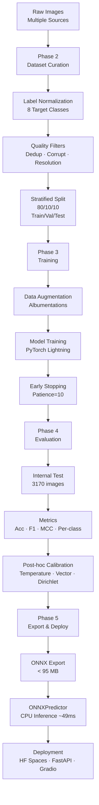

# AutoLens AI — ML Pipeline

## Overview

AutoLens AI classifies vehicle images into **8 body types** using a curated dataset and multiple CNN/ViT architectures. The pipeline follows a strict train/val/internal_test split protocol with no data leakage.

## Pipeline Diagram



## Phase 2 — Dataset Curation

**Sources:** Multiple public datasets (Kaggle, HuggingFace, Roboflow) combined into a single curated dataset.

**Target classes (8):**

| Class | Images (final) |
|---|---|
| SUV | 6,689 |
| VAN | 4,539 |
| STATION WAGON | 651 |
| MICRO | 206 |
| OPEN WHEEL / F1 | 5,846 |
| SEDAN | 8,351 |
| HATCHBACK | 2,651 |
| PICK UP | 2,679 |

**Split strategy:** Stratified 80/10/10 (train/val/test), seed=42. No overlap between splits.

**Curation policy:**
- Unsafe label mappings rejected (e.g., `City Car` ↛ MICRO, `Truck` ↛ PICK UP)
- MICRO populated only from approved model whitelist (FIAT 500, Smart Fortwo)
- Perceptual hashing (aHash64) for near-duplicate detection
- Stanford body-type source excluded to reduce leakage risk

→ Full details: [dataset.md](dataset.md)

## Phase 3 — Training

**Framework:** PyTorch Lightning with Hydra/YAML configs.

**Models trained (6 total):**

| Model | Architecture | Params | Loss | Augmentation |
|---|---|---|---|---|
| DINOv3 ViT-S/16 | Vision Transformer | 21.6M | Weighted CE + LS | Safe |
| DINOv3 ViT-S/16 (focal) | Vision Transformer | 21.6M | Focal + LS | Safe |
| DINOv3 ViT-S/16 (base) | Vision Transformer | 21.6M | CE | Standard |
| EfficientNet-B2 | CNN | ~9M | CE | Standard |
| ResNet18 | CNN | ~11M | CE | Standard |
| MobileNetV4-Conv-M | CNN | ~9M | CE | Standard |

**Training setup:**
- Optimizer: AdamW (LR: 1e-4, Weight Decay: 1e-4)
- Early stopping: patience=10, monitor=val/loss
- EMA (Exponential Moving Average) for DINOv3 runs
- Device: Apple Silicon MPS / CPU fallback
- Image size: 256×256 (DINOv3), 224×224 (CNNs)

→ Full details: [training-notes.md](training-notes.md)

## Phase 4 — Evaluation & Calibration

**Primary metric:** Macro F1-score on internal_test split (3170 images).

**Results (internal_test):**

| Rank | Model | Accuracy | F1-macro | F1-weighted |
|---:|---|---:|---:|---:|
| 1 | DINOv3 ViT-S/16 (weighted) | **0.9438** | **0.9187** | **0.9442** |
| 2 | EfficientNet-B2 | 0.9202 | 0.8982 | 0.9201 |
| 3 | ResNet18 | 0.8968 | 0.8590 | 0.8963 |
| 4 | MobileNetV4-Conv-M | 0.8905 | 0.8510 | 0.8912 |

**Post-hoc calibration:** Three methods compared (fit on val, evaluated on test):

| Method | ECE before | ECE after | NLL before | NLL after |
|---|---|---|---|---|
| Temperature Scaling | 0.0415 | 0.0136 | 0.2372 | 0.1784 |
| Dirichlet (λ=0.001) | 0.0984 | **0.0097** | 0.2644 | **0.1487** |

**Selected:** Dirichlet Calibration (ODIR λ=0.001) — best ECE and NLL improvement.

→ Full details: [model-comparison.md](model-comparison.md) · [calibration.md](calibration.md)

## Phase 5 — Export & Deploy

**Export pipeline:**
```
Lightning .ckpt → model.safetensors + metadata.json → model.onnx → calibration.json → active_model.json
```

**ONNX artifact:** 82.6 MB (under 95 MB limit ✅)

**Inference:** ONNX Runtime CPU, ~49ms/image on Apple Silicon M2 Pro.

**Deployment options:**

| Mode | Command | Port | Description |
|---|---|---|---|
| Gradio (HF Spaces) | `make demo-gradio` | 7860 | Simple upload → predict UI |
| FastAPI + React | `make demo-web` | 8000 | Full web UI with model info, GradCAM |
| HuggingFace Spaces | Auto-deploy | — | Public demo at [HF link] |

**Model source:** All models published on [HuggingFace Hub](https://huggingface.co/collections/morpeN1/autolens-vehicle-body-classification). Local download: `make download-hf-model`.
