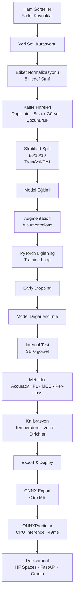

# AutoLens AI — ML Pipeline

## Genel Bakış

AutoLens AI, araç görsellerini **8 gövde tipi** sınıfına ayıran bir bilgisayarlı görü projesidir. Veri seti farklı açık kaynaklardan derlenmiş, etiketler temizlenmiş, birden fazla CNN/ViT modeli eğitilmiş ve seçilen model ONNX olarak dağıtıma hazırlanmıştır.

## Pipeline Diyagramı

## Veri Seti

Hedef sınıflar ve final kullanılabilir görsel sayıları:

| Sınıf | Görsel Sayısı |
|---|---:|
| SUV | 6,689 |
| VAN | 4,539 |
| STATION WAGON | 651 |
| MICRO | 206 |
| OPEN WHEEL / F1 | 5,846 |
| SEDAN | 8,351 |
| HATCHBACK | 2,651 |
| PICK UP | 2,679 |

Kurasyon kararları:
- Güvenli olmayan etiket eşleşmeleri kullanılmadı.
- `City Car` otomatik olarak MICRO sayılmadı.
- MICRO sınıfı yalnızca onaylı model whitelist'i ile oluşturuldu.
- Near-duplicate kontrolü için aHash64 kullanıldı.
- Leakage riskini azaltmak için bazı Stanford kaynakları dışarıda bırakıldı.

Detay: [dataset.md](dataset.md)

## Eğitim

Eğitilen modeller:

| Model | Mimari | Parametre | Ana Deney |
|---|---|---:|---|
| DINOv3 ViT-S/16 | Vision Transformer | 21.6M | Weighted CE + Safe Augmentation |
| DINOv3 ViT-S/16 focal | Vision Transformer | 21.6M | Focal Loss |
| DINOv3 ViT-S/16 baseline | Vision Transformer | 21.6M | Baseline |
| EfficientNet-B2 | CNN | ~9M | CNN baseline |
| ResNet18 | CNN | ~11M | CNN baseline |
| MobileNetV4 | CNN | ~9M | Lightweight CNN baseline |

Detay: [training-notes.md](training-notes.md)

## Sonuçlar

Internal test split üzerinde ana seçim metriği **macro F1-score** olarak kullanıldı.

| Rank | Model | Accuracy | F1-macro | F1-weighted |
|---:|---|---:|---:|---:|
| 1 | **DINOv3 ViT-S/16 weighted** | **0.9438** | **0.9187** | **0.9442** |
| 2 | EfficientNet-B2 | 0.9202 | 0.8982 | 0.9201 |
| 3 | ResNet18 | 0.8968 | 0.8590 | 0.8963 |
| 4 | MobileNetV4 | 0.8905 | 0.8510 | 0.8912 |

Detay: [model-comparison.md](model-comparison.md)

## Kalibrasyon

Seçilen modelde Dirichlet Calibration kullanıldı. Kalibrasyon validation split üzerinde fit edildi, internal_test üzerinde değerlendirildi.

| Metrik | Önce | Sonra |
|---|---:|---:|
| ECE | 0.0984 | **0.0097** |
| NLL | 0.2644 | **0.1487** |

Detay: [calibration.md](calibration.md)

## Deploy

İki çalışma modu vardır:

| Mod | Komut | Açıklama |
|---|---|---|
| Gradio | `make download-hf-model && make demo-gradio` | HF Spaces için basit demo |
| React + FastAPI | `make download-hf-model && make demo-web` | Tam lokal web arayüzü |

Model dosyaları GitHub'a konmaz; HuggingFace Hub'dan indirilir.